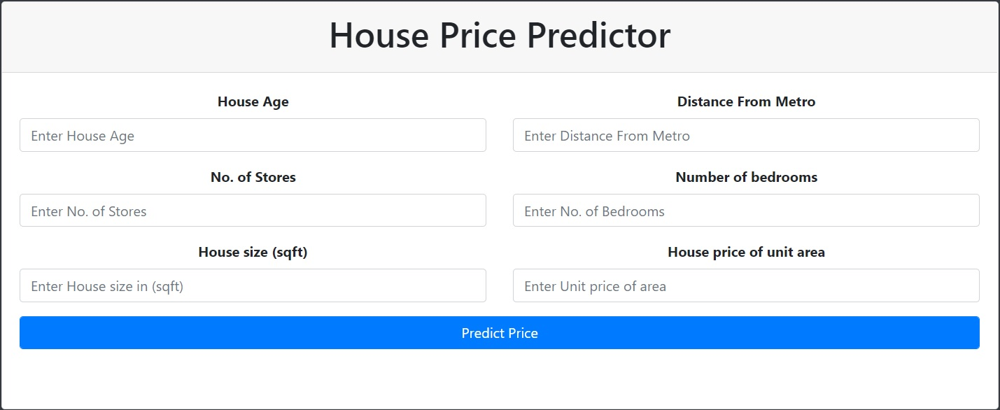

## Screenshots

# House Price Predictor

Basically this model predict house prices using parameters like 
distance from metro station, house age means(how long this house being build),
No. of stores, No. of bedrooms in the house, House size in square feet, House price per unit price etc.

## Installation

Here I use  very basic Linear Machine Learning Algorithm which are LinearRegression and Ridge.
I used bootstrap and flask module to deployment in pycharm.

### Tech Stack
Pycharm, Jupyter Notebook, Bootstrap, Flask
## Support

For support, email arjunverma9717@gmail.com

